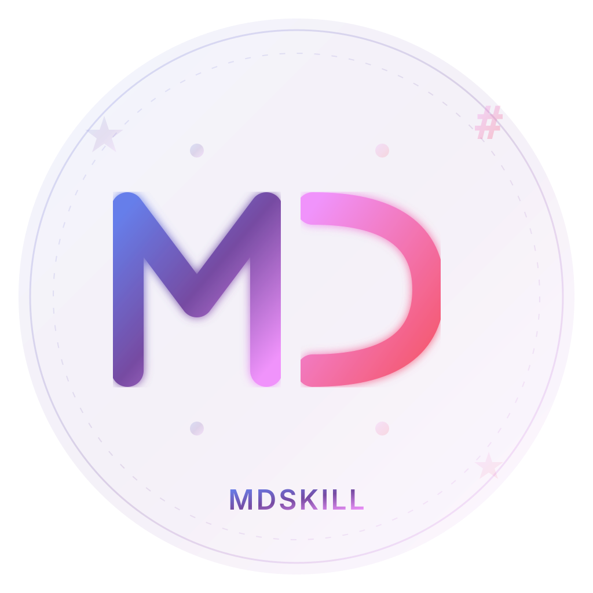

# MDskill - 现代化 Markdown 编辑器

<div align="center">



**为 macOS 打造的优雅 Markdown 编辑器**

[](CHANGELOG.md)
[](https://www.apple.com/macos/)
[](LICENSE)

[快速开始](#-安装) • [功能特性](#-特性) • [主题预览](#-8-种精美主题) • [更新日志](CHANGELOG.md)

</div>

---

## ✨ 特性

### 💎 免费版 vs 专业版

MDskill 提供**免费版**和**专业版**两种版本：

| 功能 | 免费版 | 专业版 |
|------|--------|--------|
| Markdown 编辑 | ✅ | ✅ |
| 实时预览 | ✅ | ✅ |
| 代码高亮 | ✅ | ✅ |
| 数学公式 | ✅ | ✅ |
| 多窗口编辑 | ✅ | ✅ |
| **AI Markdown 格式化** | ❌ | ✅ |
| **主题** | 1 个（GitHub Dark） | 13 个精美主题 |
| **PDF 导出** | ❌ | ✅ |
| **公众号/博客复制** | ❌ | ✅ |

**获取专业版授权：**
1. 在应用中选择"帮助" → "获取设备指纹"
2. 联系开发者（微信: **AIPMAndy**）获取授权码
3. 在应用中选择"帮助" → "激活专业版"
4. 输入授权码即可解锁所有功能

---

### 🎨 8 种精美主题（专业版）
- **多样化主题**：GitHub Dark/Light、Minimal、Literary、Tech Blue、Business、Warm、Purple
- **一键切换**：快速切换亮/暗模式
- **自动保存**：记住您的主题偏好
- **智能适配**：编辑器文字颜色自动适配主题

### 📄 PDF 导出（专业版）
- **样式保留**：完美保留当前主题样式
- **一键导出**：Cmd+E 快速导出
- **智能命名**：自动使用文件名作为 PDF 名称
- **A4 格式**：适合打印和分享

### 🪟 多窗口编辑 ⭐️ NEW in v1.1.0
- **独立窗口**：每个文件在独立窗口打开
- **并行编辑**：同时编辑多个文档
- **文件关联**：双击 .md 文件自动打开
- **高效整合**：方便多文档对比和整合

### 🎨 优雅界面
- 现代化设计语言
- GitHub 风格渲染
- 全新渐变色 Logo
- 精致的视觉效果

### ⚡️ 实时预览
- 边写边看，所见即所得
- 分屏编辑模式
- 自动滚动同步
- 防抖优化，流畅渲染

### 💻 代码高亮
- 支持 180+ 编程语言
- 自动语言检测
- GitHub 风格代码块
- 清晰的语法着色

### 🔢 数学公式
- 完整的 LaTeX 支持
- 行内和块级公式
- KaTeX 高性能渲染
- 丰富的数学符号

### ⌨️ 快捷键
- 全键盘操作
- 符合 macOS 习惯
- 快速格式化
- 高效工作流

### 🚀 高性能
- 快速启动（< 1 秒）
- 流畅渲染（60 FPS）
- 低内存占用
- Apple Silicon 原生支持

---

## 🎨 8 种精美主题

<table>
  <tr>
    <td align="center" width="25%">
      <br>
      <sub>经典暗色</sub>
    </td>
    <td align="center" width="25%">
      <br>
      <sub>清爽亮色</sub>
    </td>
    <td align="center" width="25%">
      <br>
      <sub>极简现代</sub>
    </td>
    <td align="center" width="25%">
      <br>
      <sub>文艺清新</sub>
    </td>
  </tr>
  <tr>
    <td align="center" width="25%">
      <br>
      <sub>科技蓝</sub>
    </td>
    <td align="center" width="25%">
      <br>
      <sub>商务经典</sub>
    </td>
    <td align="center" width="25%">
      <br>
      <sub>暖色温馨</sub>
    </td>
    <td align="center" width="25%">
      <br>
      <sub>紫色梦幻</sub>
    </td>
  </tr>
</table>

查看 [主题使用指南](THEMES.md) 了解更多

---

## 📦 安装

### 系统要求
- macOS 11.0 或更高版本
- Apple Silicon (M1/M2/M3/M4) 或 Intel 芯片
- 至少 100 MB 可用空间

### 下载安装

1. 下载最新版本：[MDskill-1.2.0-arm64.dmg](https://github.com/AIPMAndy/MDskill/releases)
2. 双击打开 DMG 文件
3. 拖拽到 Applications 文件夹
4. **右键点击**选择"打开"（首次需要）

**免费版**包含基础编辑功能和 1 个主题，**专业版**解锁所有 8 个主题和 PDF 导出功能。

详细安装说明请查看 [安装指南](INSTALL.md)

---

## 🚀 快速开始

### 创建新文档
```
Cmd+N 或点击"新建"按钮
```

### 切换主题
- **快速切换**：点击工具栏左侧的 🌙/☀️ 图标
- **选择主题**：点击工具栏右侧的主题下拉菜单

### 编辑 Markdown
在左侧编辑器中输入内容，右侧实时预览效果。

### 保存文档
```
Cmd+S 或点击"保存"按钮
```

更多使用技巧请查看 [快速开始指南](QUICKSTART.md)

---

## 📝 Markdown 示例

### 标题和文本
```markdown
# 一级标题
## 二级标题

这是**加粗**文本和*斜体*文本。
```

### 代码块
````markdown
```javascript
function hello() {
  console.log('Hello, MDskill!');
}
```
````

### 数学公式
```markdown
行内公式：$E = mc^2$

块级公式：
$$
\int_{-\infty}^{\infty} e^{-x^2} dx = \sqrt{\pi}
$$
```

### 表格
```markdown
| 功能 | 状态 |
|------|------|
| 编辑 | ✅ |
| 预览 | ✅ |
```

### 任务列表
```markdown
- [x] 完成安装
- [ ] 开始写作
```

---

## ⌨️ 快捷键

| 功能 | 快捷键 |
|------|--------|
| 新建窗口 | `Cmd+N` |
| 打开文件 | `Cmd+O` |
| 保存文件 | `Cmd+S` |
| 另存为 | `Cmd+Shift+S` |
| **导出 PDF** | `Cmd+E` （专业版） |
| 切换预览 | `Cmd+P` |
| 加粗 | `Cmd+B` |
| 斜体 | `Cmd+I` |
| 插入链接 | `Cmd+K` |

---

## 🔧 技术栈

- **框架：** Electron 28
- **Markdown 解析：** Marked
- **代码高亮：** Highlight.js
- **数学公式：** KaTeX
- **打包工具：** electron-builder

---

## 📚 文档

- [快速开始](QUICKSTART.md) - 5 分钟上手指南
- [功能特性](FEATURES.md) - 完整功能列表
- [安装指南](INSTALL.md) - 详细安装步骤
- [更新日志](CHANGELOG.md) - 版本历史

---

## 🗺️ 路线图

### ✅ v1.2.0（已完成）
- [x] 专业版授权系统
- [x] 设备绑定授权码
- [x] 激活界面和设备指纹
- [x] 免费版/专业版功能分级

### ✅ v1.1.0（已完成）
- [x] 8 种精美主题
- [x] 多窗口编辑支持
- [x] PDF 导出功能
- [x] 主题智能适配
- [x] 性能优化

### 🚧 v1.3.0（计划中）
- [ ] 图片粘贴和拖拽
- [ ] 自定义主题编辑器
- [ ] 文档大纲导航
- [ ] 全文搜索和替换
- [ ] Markdown 表格编辑器

### 💡 v1.4.0（规划中）
- [ ] 云同步支持
- [ ] 协作编辑
- [ ] 版本历史
- [ ] 插件系统
- [ ] AI 写作助手

---

## 🐛 问题反馈

如果遇到问题或有功能建议，欢迎联系开发者。

**AI酋长Andy**  
微信：**AIPMAndy**

---

## 📄 许可证

本项目采用 **GPL-3.0** 许可证，同时提供**商业授权**：

### 开源使用（GPL-3.0）
- ✅ **个人使用**：完全免费
- ✅ **学习研究**：自由修改和学习
- ✅ **开源项目**：可用于其他 GPL 兼容的开源项目
- ⚠️ **衍生作品**：必须同样开源并使用 GPL-3.0

### 商业授权
如果您需要：
- 在闭源商业软件中使用 MDskill 代码
- 不希望受 GPL-3.0 开源要求约束
- 获得技术支持和定制开发

请联系获取商业授权：
- 微信：**AIPMAndy**
- 邮箱：通过 GitHub 联系

### 专业版授权
MDskill 应用本身分为**免费版**和**专业版**：
- **免费版**：基础编辑功能 + 1 个主题
- **专业版**：所有 8 个主题 + PDF 导出（需购买授权码）

**获取专业版授权码：**
1. 应用内获取设备指纹
2. 联系开发者（微信: **AIPMAndy**）
3. 一次购买，终身使用（绑定设备）

详见 [LICENSE](LICENSE) 文件

---

## 👨‍💻 开发者

**AI酋长Andy 出品**

- 微信：**AIPMAndy**
- GitHub: [@AIPMAndy](https://github.com/AIPMAndy)

---

<div align="center">

**享受写作！** ✨

Made with ❤️ by AI酋长Andy

合作微信：**AIPMAndy**

</div>
